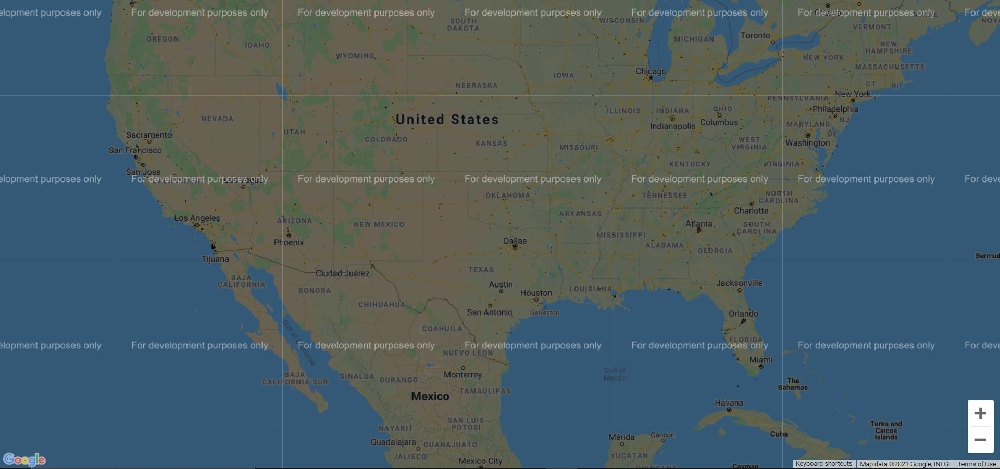
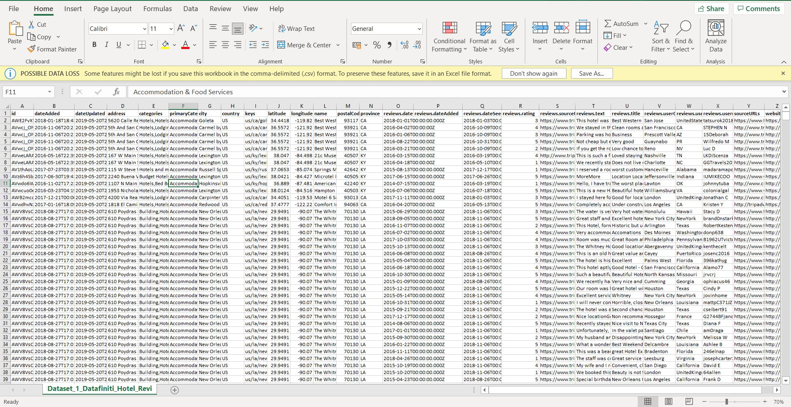

# Hotel_review_analysis
Using NumPy, pandas, and matplotlib to analyze hotels data from around the  world and plotting some useful data. 
* Menu driven to run desired query 
* map.html will be generated in same directory when corresponding query is executed

## map view
* black dots represents hotel on map

  

## Dataset

  

